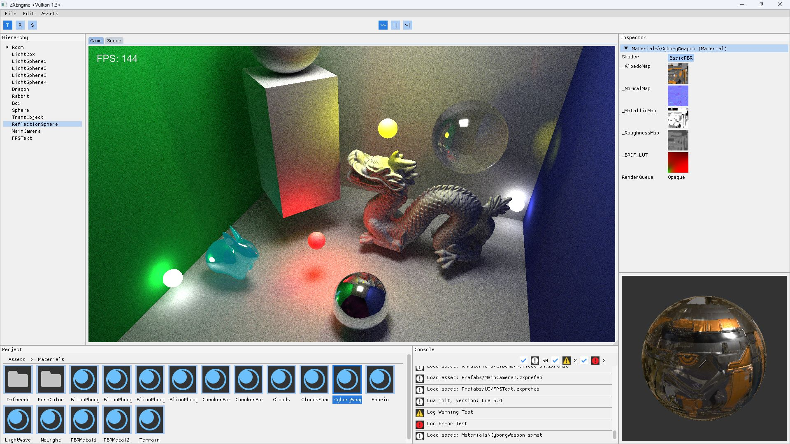
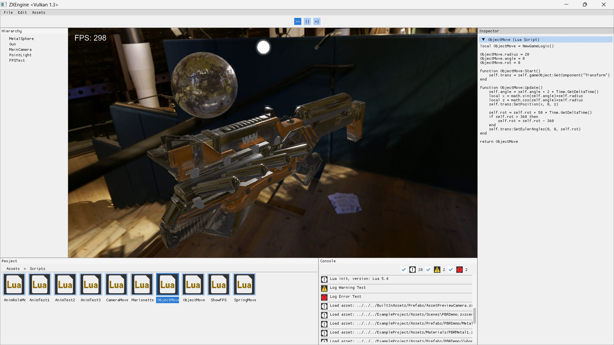
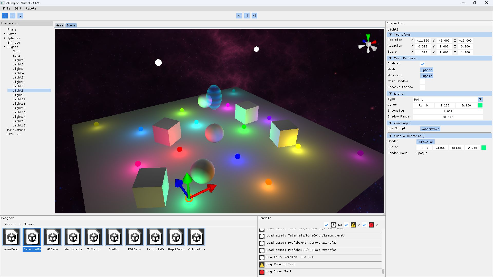
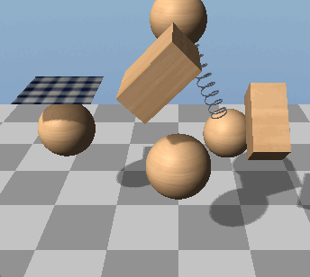

# ZXEngine

| Graphics API | Platform |
| :----------: | :------: |
|    |    |

这是我自己开发的游戏引擎项目，创建这个项目的主要目的是为了我自己学习和实践游戏引擎技术，不过也希望这个项目能对你有所帮助。

This is a game engine project. The main purpose that I created this project is to learn and practice game engine technology. And I hope this project will be helpful to you.

本项目以游戏引擎为目标，而并非只关注图形渲染（不过图形渲染也是一个重要模块）。引擎基本外观如下图，具体内容请看图示后面的目录。

This project aims at a game engine, not just graphics and rendering (although this is also an important contents). The appearance of the engine is shown in the figure below. For specific content, please see the table of contents behind the figure.



## 目录(Contents)

- [引擎简介 (Engine Introduction)](#引擎简介-engine-introduction)

- [引擎编辑器和更多演示 (Engine Editor And More Demonstration)](#引擎编辑器和更多演示-engine-editor-and-more-demonstration)

- [多套内置渲染管线 (Multiple Built-in Rendering Pipelines)](#多套内置渲染管线-multiple-built-in-rendering-pipelines)

- [PhysZ物理引擎简介 (PhysZ Physics Engine Introduction)](#physz物理引擎简介-physz-physics-engine-introduction)

- [ZXShader和材质系统 (ZXShader And Material System)](#zxshader和材质系统-zxshader-and-material-system)

- [骨骼蒙皮动画系统 (Skeletal Animation System)](#骨骼蒙皮动画系统-skeletal-animation-system)

- [粒子系统 (Particle System)](#粒子系统-particle-system)

- [游戏UI系统 (Game UI System)](#游戏ui系统-game-ui-system)

- [GamePlay层的Lua系统 (Lua System of GamePlay Layer)](#gameplay层的lua系统-lua-system-of-gameplay-layer)

- [音频系统 (Audio System)](#音频系统-audio-system)

- [多线程与JobSystem (Multithreading And JobSystem)](#多线程与jobsystem-multithreading-and-jobsystem)

- [C++反射与序列化 (C++ Reflection And Serialization)](#c反射与序列化-c-reflection-and-serialization)

- [引擎文件格式介绍 (Engine File Format Introduction)](#引擎文件格式介绍-engine-file-format-introduction)

- [实际游戏项目演示 (Actual Game Project Demonstration)](#实际游戏项目演示-actual-game-project-demonstration)

- [构建与跨平台 (Build And Cross-Platform)](#构建与跨平台-build-and-cross-platform)

- [注意事项 (Precautions)](#注意事项-precautions)

## 引擎简介 (Engine Introduction)

本引擎目前同时支持Vulkan，DirectX 12和OpenGL，支持Windows，macOS和Linux。使用自创的zxshader语言来编写shader，支持前面三种图形API，可一次编写3种环境运行。本引擎同时也支持基于Vulkan和DirectX12的光线追踪渲染管线。

This engine currently supports Vulkan, DirectX 12 and OpenGL, supports Windows, macOS and Linux. The engine uses the self-created zxshader language to write shaders. It also supports Vulkan, DirectX 12 and OpenGL. You only need to write it once and it can work in all three graphics APIs. This engine also supports ray tracing rendering pipeline based on Vulkan and DirectX12.

本引擎内置了我写的物理引擎PhysZ(看了一些书和别人的项目之后的学习成果，详见后文)，支持基本的刚体力学模拟和布料模拟。同时我也开发了简单的骨骼蒙皮动画系统，粒子系统，UI系统，JobSystem等。文档后面会有这些系统的图片展示。

This engine has a built-in physics engine written by myself, which I called it PhysZ (It is the learning result after reading some books and other people’s projects), supports rigid body mechanics simulation and cloth simulation. And I also developed a simple skeletal animation system, particle system, UI system, JobSystem, etc. Images of these systems are shown later in this document.

引擎本身用C++开发，GamePlay层使用Lua语言，引擎层封装部分C++接口给GamePlay层的Lua调用。使用方式类似Unity的XLua，通过一个GameLogic组件把Lua代码绑定到GameObject上，接收所挂载对象上来自引擎的Start和Update调用，并通过self访问GameObject对象(具体示例看后面)。

The engine is developed with C++, the GamePlay layer uses Lua language, and the engine encapsulates part of the C++ interface to the Lua call of the GamePlay layer. The usage is similar to Unity's XLua, you can bind the Lua code to the GameObject through a GameLogic component, receive Start and Update calls from the engine on the mounted object, and access the GameObject object through self (see later for specific examples).

项目目前已经完成了引擎所需的基本的场景，预制体，材质系统，shader文件系统等等的开发。引擎场景中的对象都是Unity式的 GameObject - Component 结构，也有一个类Unity的引擎编辑器页面。不过编辑功能还不完善，只有一部分 Component 能够被编辑，其它的主要是展示当前的运行时状态。

The project has now completed the development of the basic scenes, prefabs, materials system, shader file systems and so on that the engine need. The objects in the scene of this engine are all Unity-style GameObject - Component structures, and there is also a Unity-like engine editor. However, the editing function is not complete yet, only some Components can be edited, and the others just display the current runtime status.

## 引擎编辑器和更多演示 (Engine Editor And More Demonstration)

下面是一些图片展示，引擎页面如图，和Unity编辑器类似。上面是主菜单栏，中间是游戏画面窗口，左边是展示场景中GameObject的Hierarchy面板，下面左边是展示当前打开项目的Assets文件目录的Project面板，中间是展示日志的Console面板，右边是展示当前选中对象详细信息的Inspector面板。

The following are some picture displays, the engine is shown in the figure, which is similar to the Unity editor. The top is the main menu bar, the middle is the game screen window, the left is the Hierarchy panel showing the GameObject in the scene, the lower left is the Project panel showing the Assets file directory of the currently opened project, the middle is the Console panel showing the log, and the right is showing the currently selected Inspector panel for object details.


当前选中了场景中的Sun对象，Inspector面板就展示这个GameObject所挂载的Component信息。

The Sun object in the scene is currently selected, and the Inspector panel displays the Component information on the GameObject.

点击主菜单栏的运行按钮，游戏开始运行，此时能看到场景中物体动了起来，粒子系统也开始工作。

Click the Play button on the main menu bar, and the game starts to run. At this time, you can see the objects in the scene move, and the particle system starts to work. 

接下来展示的是一个基于PBR+IBL场景渲染，同时展示了点击材质文件后Inspector面板展示的材质信息和材质预览。

Next picture is a scene rendering based on PBR+IBL, and also shows the material information and material preview displayed on the Inspector panel after clicking the material file.


然后通过双击场景文件，切换到一个使用光线追踪渲染管线渲染的场景。同时展示了点击模型文件后Inspector面板展示的模型信息和模型预览，如果模型带有动画还会显示骨骼和动画信息。

Then switch to a scene rendered with the ray tracing pipeline by double-clicking on the scene file. At the same time, it shows the model information and model preview displayed on the Inspector panel after clicking the model file. If the model has animation, the skeleton and animation information will also be displayed.


接下来展示的是通过算法生成的体积云及其阴影投射效果。同时展示了点击图片文件后，Inspector面板显示的图像信息。

Shown next are code-generated volumetric clouds and their shadow casting effects. And the right side shows the image information displayed on the Inspector panel after clicking the image file.


下面是分别点击zxshader和Lua后Inspector上的代码预览。

The following is the code preview on the Inspector after clicking zxshader and Lua respectively.




## 多套内置渲染管线 (Multiple Built-in Rendering Pipelines)

本引擎有3套内置渲染管线，分别是正向渲染管线，延迟渲染管线和光线追踪渲染管线。其中前两种属于光栅化渲染。

ZXEngine has three built-in rendering pipelines, which are forward rendering pipeline, deferred rendering pipeline and ray tracing rendering pipeline. The first two of these belong to the rasterization rendering.

引擎的场景文件中保存了渲染管线信息，在切换场景的时候引擎会直接无缝切换渲染管线。所以想运行哪套渲染管线，直接在引擎编辑器中双击对应的场景文件切换即可。

The rendering pipeline information is saved in the scene file of the engine, and the engine seamlessly switches the rendering pipeline directly when switching scenes. So if you want to run which rendering pipeline, just double-click the corresponding scene file in the engine editor to switch.

使用正向渲染管线和光追渲染管线的场景已经在前面演示过了，这里再补充一个延迟渲染管线的演示场景：

Scenes using forward rendering pipeline and ray tracing rendering pipeline have been demonstrated previously. Here is a demonstration scene of deferred rendering pipeline:



## PhysZ物理引擎简介 (PhysZ Physics Engine Introduction)

先展示一下PhysZ引擎对刚体力学和布料的模拟效果(GIF演示，截屏大小和帧率都有压缩):

Here is a GIF of the simulation of rigid mechanics and cloth in PhysZ (the size and framerate of the screenshots are compressed):



使用基本的PhysZ物理引擎只需要关心两个Component，Collider和Rigidbody。其中Collider目前提供了三种类型：BoxCollider，PlaneCollider和SphereCollider。下面是这两个Component在引擎里编辑器里的截图：

Using the PhysZ engine involves only two Components, Collider and Rigidbody. Collider currently provides three types: BoxCollider, PlaneCollider and SphereCollider. The following are screenshots of these two Components in the editor in the engine:


各参数作用顾名思义即可。其中Damping参数是模拟各种形式的阻尼效果的，Linear Damping和Angular Damping分别对应线性运动和角运动，数值为0代表无阻尼。

The function of each parameter is just as the name implies. And the Damping parameter is used to simulate various forms of damping effects. Linear Damping and Angular Damping correspond to linear motion and angular motion respectively. A value of 0 represents no damping.

弹簧组件如图，类似Unity的SpringJoint，参数分别是连接对象，自己和连接对象的锚点(各自的模型空间)，弹簧的松弛长度和弹簧系数。

The spring component is shown in the figure, similar to Unity's SpringJoint. The parameters are the connection object, the anchor points of itself and the connection object (their respective model spaces), the rest length and spring coefficient of the spring.


布料模拟需要添加一个Cloth组件，参数分别是布料质量，摩擦系数，弯曲刚度，拉伸刚度和是否使用重力。注意布料需要配合动态Mesh，本引擎暂时只支持DynamicPlane。

Cloth simulation needs to add a Cloth component, the parameters are cloth mass, friction coefficient, bend stiffness, stretch stiffness and whether to use gravity. Note that cloth needs to be matched with dynamic mesh. This engine currently only supports DynamicPlane.


PhysZ引擎主要是我在学习了Ian Millington的《Game Physics Engine Development》和Gabor Szauer的《Game Physics Cookbook》之后，加上一些自己的思考和实践的成果。引擎里的注释也比较多，欢迎对物理引擎感兴趣的人一起讨论学习。

The PhysZ engine is the result of me studying Ian Millington's "Game Physics Engine Development" and Gabor Szauer's "Game Physics Cookbook", plus some of my own thinking and practice. If you are also interested in physics engines, I hope this engine can be helpful to you.

## ZXShader和材质系统 (ZXShader And Material System)

ZXShader是专门给ZXEngine用的一套Shader系统，因为ZXEngine同时支持Vulkan/DirectX12/OpenGL，所以也需要一个统一的Shader语言才能支撑后面的材质系统。ZXShader目前暂时只支持光栅渲染管线，光追渲染管线的Shader是在VK和DX下独立写的。ZXShader语言本身并不复杂，对GLSL，HLSL或者Unity ShaderLab比较熟悉的人应该都能很快看懂，代码示例在ExampleProject\Assets\Shaders中。

ZXShader is a shader system specially used for ZXEngine. Because ZXEngine supports Vulkan/DirectX12/OpenGL, a unified shader language is needed to support the material system. ZXShader currently only supports the rasterization rendering pipeline. The Shader of the raytracing rendering pipeline is written independently under VK and DX. The ZXShader language itself is not complicated. People who are familiar with GLSL, HLSL or Unity ShaderLab should be able to understand it quickly. The code examples are in ExampleProject\Assets\Shaders.

材质系统和Unity的比较类似，就是挂一个Shader，然后可以在编辑器面板上看到这个Shader暴露给引擎的参数。并且可以通过引擎编辑器调整参数数值，然后实时看到渲染结果的动态反馈。直接调整正在运行的场景中的材质：

The material system is similar to Unity's. Select a Shader, and then you can see the parameters exposed by this shader to the engine on the editor panel. And you can adjust parameter values through the engine editor, and then see the feedback of the rendering results in real time. For example, adjust the materials in the running scene:


选中Asset中的材质后，直接调整材质参数，在材质球上预览变化：

This is after selecting the material in the Asset, adjusting the material parameters, and previewing the changes on the material ball:


## 骨骼蒙皮动画系统 (Skeletal Animation System)

切换到AnimDemo场景，点击运行按钮后，可以看到骨骼蒙皮动画的展示:

Switch to the AnimDemo scene and click Play button to see the skeletal animation display:


本引擎的动画系统支持动画混合，所以这里除了能看到单个动画播放外，还能看到人物从走路状态进入跑步状态时，两个动画之间流畅的过渡。

The animation system of this engine supports animation blending, so in addition to the individual animation playback, you can also see the smooth transition between the two animations when the character enters the running state from the walking state.

这个动画系统也使用了引擎内置的JobSystem来优化性能。

This animation system also uses the engine's built-in JobSystem to optimize performance.

这里动画的播放代码属于业务逻辑模块而不是引擎，所以是写在Lua代码中的，通过GameLogic组件绑定到对应的GameObject上。

The code to play the animation belongs to the GamePlay rather than the engine, so it‘s written in the Lua code and bound to the GameObject through the GameLogic component.

## 粒子系统 (Particle System)

本引擎有一个简易的粒子系统，可以配置一些简单的粒子特效，使用GPU Instance渲染。示例如下：

This engine has a simple particle system, which can be used to configure some particle effects, rendered by GPU Instance. Examples are as follows:


引擎编辑器中的粒子系统面板如下，由于参数较多就不详细介绍了，感兴趣的可以打开示例工程中的ParticleDemo场景自行调试：

The particle system panel in the engine editor is as follows. Since there are numerous parameters, their explanation is not written here in detail. If you're interested, you can open the ParticleDemo scene in the example project to try it out:


## 游戏UI系统 (Game UI System)

本引擎提供了一个简单的游戏UI系统，一个示例如下(更多演示请看后面的实际游戏项目演示)：

This engine provides a simple game UI system, an example is shown below (see the actual game project demo below for more examples) :


这里的UI主要有2类：一类是基于屏幕空间的UI，也就是常规的覆盖到屏幕上的，如图中点击地块后出现的弹窗。第二类是基于世界空间的UI，也就是存在于三维空间中的UI，如图中地块上的名牌。

There are two types of UI here: one is the screen-space UI, which is overlaid on the screen, such as the pop-up window that appears when you click on the tile in the picture. The second type is the world-space UI, which is the UI that draw in three-dimensional space, such as the nameplate on the tile in the picture.

目前有四个基本的UI组件，分别是RectTransform，UITextRenderer，UITextureRenderer和UIButton。

There are currently four basic UI components, RectTransform, UITextRenderer, UITextureRenderer, and UIButton.

### RectTransform:


RectTransform是用于基于屏幕空间的UI的特殊Transform，可以更方便直观地调节UI。在RectTransform中的Position的X和Y值含义变成了相对父节点的像素偏移量，而不是普通Transform中的局部空间位置。这个偏移量是基于父节点(或屏幕)的位置，大小和锚点的。因此基于RectTransform也实现了UI对屏幕分辨率的自适应。

RectTransform is a special Transform for screen-space based UI that makes adjusting the UI easier and more intuitive. The X and Y values of position in RectTransform become pixel offsets relative to the parent node, rather than local space positions in ordinary Transforms. This offset is based on the position, size, and anchor of the parent node (or screen). Therefore, based on RectTransform, the UI is also adaptive to the screen resolution.

比如我有一个UI组件希望定位到画面左上角，则Vertical Anchor选择Top，Horizontal Anchor选择Left，X和Y填写相对屏幕左上角的偏移量即可。如果是UI系统中的子对象，锚点就会基于父节点位置和Size来定位子对象。

For example, if I want to position a UI component in the upper left corner of the screen, I can select Top for Vertical Anchor, Left for Horizontal Anchor, and set X and Y to the offset relative to the upper left corner of the screen. If it‘s a child object in the UI system, the anchor will position the child object based on the parent node position and size.

如果不使用RectTransform而是使用Transform，就相当于直接把UI放到了场景中，会以3D的形式去绘制。

If you use Transform instead of RectTransform, it means that you put the UI into the scene, and it will be drawn in 3D.

### UITextRenderer:


Text是UI文本内容，后面的参数为字体大小，文本对齐方式和文本颜色。文本内容可以提前设置好保存在Prefab中，也可以在运行时直接通过引擎编辑器实时修改，或者在代码中动态设置，代码示例如下：

Text is the UI text content, followed by the font size, text alignment, and text color. Text content can be pre-set and saved in prefab, modified in real time through the engine editor at run time, or dynamically set in code, as shown in the following code example:

```lua
function ShowFPS:Start()
    -- Get UI text component
    self.FPSTextCom = self.gameObject:GetComponent("UITextRenderer")
end

function ShowFPS:Update()
    local curFPS = CalculateFPS()
    -- Set the content
    self.FPSTextCom:SetText("FPS: " .. curFPS)
end
```

### UITextureRenderer and UIButton:


目前这两个组件在引擎编辑器中仅展示自身相关信息，不提供编辑功能。其中UIButton可以在Lua代码中注册点击后的回调函数，方式如下：

At present, these two components only display information about themselves in the engine editor, and do not provide editing functions. And UIButton can register a click callback function in Lua code, as follows:

```lua
function UILogicExample:Start()
    local btnYesGO = self.gameObject:FindChild("Panel/BtnYes")
    btnYesGO:GetComponent("UIButton"):SetClickCallBack(self.OnBtnClickCallBack, ...)
end

function UILogicExample:OnBtnClickCallBack()
    Log("The yes button is clicked.")
end
```

## GamePlay层的Lua系统 (Lua System of GamePlay Layer)

本引擎的GamePlay层使用Lua语言，引擎将需要提供给GamePlay层的C++接口都Wrap到了Lua，开发方式有点类似于Unity中的XLua。不过目前Wrap到Lua的接口还不是特别多，以后逐步完善。这里只简单演示一下Lua脚本系统和引擎的Lua接口，更多更详细的演示请看后面的实际游戏项目演示。

The GamePlay layer of this engine uses Lua language. The engine wraps all the C++ interfaces that need to be provided to the GamePlay layer into Lua. The development way is similar to XLua in Unity. However, there are not many interfaces that have been wrapped to Lua at present, and they will be gradually added in the future. Here we only briefly demonstrate the Lua scripting system and the Lua interface of the engine. For more detailed demonstrations, please see the actual game project demonstration in the following document.

使用方式是直接创建一个Lua代码，然后用GameLogic组件把Lua代码挂载到一个GameObject对象上，然后这个Lua代码就可以接收来自引擎的Awake，Start，Update和FixedUpdate等接口的调用了。也可以通过self来访问自己所挂载的GameObject对象，获取Component，调用引擎接口等等。

The way to use lua in ZXEngine is to create a Lua code, and then use the GameLogic component to load the Lua code to a GameObject. Then the Lua code can receive calls from the engine's Awake, Start, Update and FixedUpdate. You can also use self to access the GameObject you bound, obtain components, call the engine interface, etc.

以控制GameObject移动和旋转为例，可以写一个ObjectMove.lua脚本，然后挂到一个GameObject上。这里我们可以暴露一些Lua脚本中的变量到编辑器面板上，以便在引擎编辑器中直接修改Lua变量的值，方便调试，也方便同一个脚本挂到不同GameObject上时使用不同的参数。这些变量的值会保存到zxprefab文件中，运行时在Awake之前完成初始化。比如我们的ObjectMove.lua脚本暴露了一个speed变量来控制物体移动速度：

Take controlling the movement and rotation of GameObject as an example. Write an ObjectMove.lua and bind it to a GameObject. Here we can expose some variables from the Lua script to the editor panel so that the values of the Lua variables can be modified in the engine editor for debugging purposes and for using different parameters when the same script is bound to different GameObjects. The values of these variables are stored in a zxprefab file and will be initialized at runtime before Awake. For example, our ObjectMove.lua script exposes a speed variable to control how fast objects move:


这个Lua脚本大致如下：

And the Lua script looks something like this:

```lua
local ObjectMove = NewGameLogic()

ObjectMove.speed = 2

ObjectMove.radius = 20
ObjectMove.angle = 0
ObjectMove.rot = 0

function ObjectMove:Start()
    self.trans = self.gameObject:GetComponent("Transform")
end

function ObjectMove:Update()
    self.angle = self.angle + self.speed * Time.GetDeltaTime()
    local x = math.sin(self.angle) * self.radius
    local z = math.cos(self.angle) * self.radius
    self.trans:SetPosition(x, 0, z)

    self.rot = CalculateRotation();
    self.trans:SetEulerAngles(0, 0, self.rot)
end

return ObjectMove
```

如果是要调用物理引擎相关的接口，和在Unity里一样，需要把代码写到FixedUpdate里面，否则物理效果会有异常。代码示例：

If you want to call the interface related to the physics engine, just like in Unity, you need to write the code in FixedUpdate, otherwise the physical effect will be wrong. Code example:

```lua
local PhysControl = NewGameLogic()

PhysControl.force = { x = 0, y = 100, z = 0 }
PhysControl.velocity = { x = 10, y = 0, z = 0 }

function PhysControl:Start()
    -- Find some gameobject in the scene and control it.
    self.rigidBody = GameObject.Find("SomeObj/SubObj"):GetComponent("RigidBody")
end

function PhysControl:FixedUpdate()
    self.rigidBody:AddForce(self.force)
    self.rigidBody:SetVelocity(self.velocity)
end

return PhysControl
```

如果要在运行时创建GameObject，可以直接通过如下接口读取Prefab并创建：

If you want to create a GameObject at runtime, you can read the Prefab and create it through the following interface:

```lua
local newGO = GameObject.Create("Path/To/Example.zxprefab")
```

不过如果你需要为一个Prefab创建多个实例，最好通过如下方式先加载Prefab，然后再实例化多个，避免重复的IO开销：

However, if you need to create multiple instances of a prefab, it is better to load the prefab first and then instantiate multiple instances to avoid repeated IO cost:

```lua
local prefab = Resources.LoadPrefab("Path/To/Example.zxprefab")

local allGO = {}

for i=1, 100 do
    local newGO = GameObject.CreateInstance(prefab)
    table.insert(allGO, newGO)
end
```

如果要接收输入事件，比如写一个Lua脚本挂到相机上控制镜头移动，那么可以注册来自引擎的输入事件。比如注册按住WSAD的回调函数：

If you want to receive input events, such as writing a Lua script to control camera movement, you can register input events from the engine. For example, register the callback function for pressing WSAD:

```lua
EngineEvent:AddEventHandler(EngineEventType.KEY_W_PRESS, MoveForwardCallBack)
EngineEvent:AddEventHandler(EngineEventType.KEY_S_PRESS, MoveBackCallBack)
EngineEvent:AddEventHandler(EngineEventType.KEY_A_PRESS, MoveLeftCallBack)
EngineEvent:AddEventHandler(EngineEventType.KEY_D_PRESS, MoveRightCallBack)
```

ZXEngine的Lua系统接口就不一一列举了，可以到示例工程里细看。

I won’t list ZXEngine’s Lua system interfaces one by one. You can go to the example project to take a look.

## 音频系统 (Audio System)

本引擎的音频系统类似Unity，主要依靠AudioListener和AudioSource这两个组件。

The audio system of this engine is similar to Unity, mainly relying on the two components AudioListener and AudioSource.

AudioSource如下，各参数都比较好理解。

AudioSource is as shown below. These parameters are easy to understand.


其中最后两个参数只在勾选3D音效后生效。MinDistance表示小于这个距离之后音量不会再增大，MaxDistance表示大于这个距离后音量不会再减小。

The last two parameters only take effect in 3D sound effects. When the distance is less than MinDistance, the volume will no longer increase, and when the distance is greater than MaxDistance, the volume will no longer decrease.

AudioListener同样也是用于3D音效的，如果你不需要3D音效的话场景里可以没有这个组件。这个组件挂载到哪个GameObject上就会用哪个GameObject计算3D音效。和Unity一样这个组件不需要任何参数，一般会挂载到主相机所在的GameObject上，如图：


本引擎的绝大部分系统和模块都是我自己编写的，但是音频处理是一个和图形渲染，物理引擎一样很专业的领域，涉及音频编码和时域频域变换等相关专业知识。而我对音频相关的专业知识了解还不够，所以目前本引擎音频系统中的核心部分，即音频解码和播放功能使用了irrKlang这个第三方库。由于irrKlang没有对Apple Silicon做支持，所以在macOS上的音频系统目前是一个空的实现。

Most of the systems and modules of this engine are written by myself, but audio processing is a very professional field like graphics rendering and physics engine, involving audio coding, time domain and frequency domain transformation and other related professional knowledge. I don’t know enough about audio-related professional knowledge, so the core part of the audio system of this engine, that is, the audio decoding and playback functions, uses the third-party library irrKlang. Since irrKlang does not support Apple Silicon, the audio system on macOS is currently an empty implementation.

## 多线程与JobSystem (Multithreading And JobSystem)

目前引擎中有三个多线程模块，异步加载资源，着色器预编译和一个简易的JobSystem。其实我还想搞多线程渲染，也在实际尝试搞，但确实有点困难，需要大改引擎框架，所以还没搞好，先鸽着。

Currently, there are three multi-threaded modules in the engine: asynchronous resource loading, shader precompilation and a simple JobSystem. In fact, I also want to do multi-threaded rendering, and I‘m actually trying to do it, but it's indeed difficult and requires a lot of modifications to the engine framework, so I haven't done it yet.

资源异步加载的接口如下，直接在主线程(也是逻辑线程)中调用即可：

The interface for asynchronous loading is as follows, which can be called in the main thread (also the logical thread):

```c++
C++ Interface:
static void ZXEngine::GameObject::AsyncCreate(const string& path);

static void ZXEngine::Resources::AsyncLoadPrefab(const string& path, std::function<void(PrefabStruct*)> callback, bool isBuiltIn = false);

static void ZXEngine::Resources::AsyncLoadMaterial(const string& path, std::function<void(MaterialStruct*)> callback, bool isBuiltIn = false, bool isEditor = false);

static void ZXEngine::Resources::AsyncLoadModelData(const string& path, std::function<void(ModelData*)> callback, bool isBuiltIn = false, bool isEditor = false);
```

```lua
Lua Interface:
GameObject.AsyncCreate(path)
```

然后是着色器预编译，在引擎编辑器顶部的菜单栏点击Asset/Compile All Shader for Vulkan或者Compile All Shader for DirectX12，就会开启一个线程去编译Shader。

As for shader pre-compilation, click "Asset/Compile All Shader for Vulkan" or "Compile All Shader for DirectX12" in the menu bar at the top of the engine editor, and a thread will be created to compile the shaders.

### JobSystem

最后是JobSystem，使用方式类似Unity的JobSystem。自己创建一个类继承Job，然后覆写Execute接口。

Next is JobSystem, which is used in a similar way to Unity's JobSystem. Create a class that inherits Job and override the Execute function.

```c++
class ExampleJob : public Job
{
public:
    std::atomic_int num;
    
    void Execute() override
    {
        for (int i = 0; i < 100000; i++)
        {
            num++;
        }
    };
};
```

使用的时候new一个Job，然后调用Schedule让Job自动进入到JobSystem被调度和执行，返回一个JobHandle。然后在需要同步数据的地方调用JobHandle的Accomplish接口即可。

When using it, create a new Job and call Schedule to automatically schedule and execute the Job in the JobSystem, returning a JobHandle. Then call the Accomplish of JobHandle where you need to synchronize data.

```c++
ExampleJob* job = new ExampleJob();
job->num = 123;

JobHandle handle = job->Schedule();

// Do something else
......

handle.Accomplish();

std::cout << "Res: " << job->num << std::endl;
```

如果需要使用JobSystem处理一些复杂数据，那么为了保证数据的线程安全，最好配合引擎的ThreadSafeData使用。具体例子可以参考引擎中的骨骼蒙皮动画模块。

If you need to use JobSystem to process some complex data, it's better to use it with the engine's ThreadSafeData in order to keep the data thread-safe. For specific examples, please refer to the skeletal animation system in this engine.

由于引擎的GamePlay层使用的语言为Lua，而Lua解释器并不支持多线程解释执行代码，所以这套JobSystem目前只能在引擎内部使用，并未暴露给GamePlay层。

Because the language of the GamePlay layer of the engine is Lua, and the Lua interpreter does not support multi-threaded interpretation of the Lua code, the JobSystem can only be used in the C++ engine at present, and is not exposed to the GamePlay layer.

## C++反射与序列化 (C++ Reflection And Serialization)

本引擎实现了一套简单的C++反射系统，包括静态反射和动态反射两种。这套反射系统的实现主要参考了[mirror](https://github.com/VisualGMQ/mirrow)和[rttr](https://github.com/rttrorg/rttr)这两个库。目前反射系统在项目中的实际运用是实现了一套C++对象的序列化与反序列化工具。

This engine has a simple C++ reflection system, including static reflection and dynamic reflection. The implementation of this reflection system mainly refers to [mirror](https://github.com/VisualGMQ/mirrow) and [rttr](https://github.com/rttrorg/rttr). At present, the actual use of the reflection system in this project is to implement a C++ object serialization and deserialization tool.

### Serialization

序列化工具接口如下：

The serialization tool interface is as follows:

```c++
// Serialize an object to string
template <typename T>
static string Serialize(const T& object);

// Deserialize an object from string
template <typename T>
static T Deserialize(const string& data);

// Deserialize an object from string
template <typename T>
static void Deserialize(T& object, const string& data);
```

### Reflection

反射系统接口比较复杂，这里只演示一部分。假设有一个Student类：

The reflection system has more interfaces than serialization, and only some of them are shown here. Suppose you have a Student class:

```c++
class Student
{
public:
    string mName;
    uint32_t mAge = 0;
    float mHeight = 0.0f;
    Vector3 mPos;

    int GetAge() const { return mAge; }

    void Speak(const string& words)
    {
        Debug::Log("Student speak: %s", words);
    }
};
```

#### Static Reflection:

```c++
#include "Reflection/StaticReflection.h"

// Register the Student class
StaticReflection
(
    Student,
    Fields
    (
        Field(&Student::mName),
        Field(&Student::mAge),
        Field(&Student::mHeight),
        Field(&Student::mPos)
    )
)

int main()
{
    // Create an instance
    Student object;
    
    // Get type info
    auto typeInfo = Reflection::Static::Reflect(object);
    
    // Traverse all member and print their name and value
    typeInfo.TraverseMemberVariableAndDo
    (
        [&](auto& field)
        {
            auto& member = field.Invoke(object);
            Debug::Log("Member name: %s, value: %s", field.GetName(), member);
        }
    );
}
```

#### Dynamic Reflection:

```c++
#include "Reflection/DynamicReflection.h"

int main()
{
    // Register the Student class
    Reflection::Dynamic::Register<Student>()
        .Register("Student")
        .AddVariable("mName",   &Student::mName)
        .AddVariable("mAge",    &Student::mAge)
        .AddVariable("mHeight", &Student::mHeight)
        .AddVariable("mPos",    &Student::mPos)
        .AddFunction("GetAge",  &Student::GetAge)
        .AddFunction("Speak",   &Student::Speak);
    
    // Create an instance
    Student object;
    
    // Get type info
    auto typeInfo = Reflection::Dynamic::GetTypeInfo("Student")->AsClass();
    
    // Set member value by name
    typeInfo->SetVariable(&object, "mAge", 12);

    // Traverse all member and print their name and value
    for (auto& item : typeInfo->GetVariables())
    {
        Debug::Log("Variable: %s %s", item->type->GetName(), item->name);
    }
    
    // Traverse all function and print their name, return type and parameters type
    for (auto& item : typeInfo->GetFunctions())
    {
        Debug::Log("Function: %s return %s", item->name, item->returnType->GetName());
        for (auto& param : item->paramTypes)
            Debug::Log("Param: %s", param->GetName());
    }
}
```

更多的反射接口，使用方式以及序列化工具等等的演示，请参考Test\ReflectionAndSerializationCase.h

For more reflection interfaces, use way and serialization tool demonstration, etc. please refer to Test\ReflectionAndSerializationCase.h

## 引擎文件格式介绍 (Engine File Format Introduction)

### *.zxscene

场景文件，包含GameObjects，天空盒等。如果是光线追踪场景，还包含了光追管线的Shader。

Scene files, containing GameObjects, skyboxes, etc. If it is a ray tracing scene, it also includes the Shader of the light tracing pipeline.

### *.zxshader

这是本引擎自己的shader语言文件，不过目前zxshader仅支持DirectX 12，Vulkan和OpenGL的光栅化渲染管线。示例代码可以在ExampleProject\Assets\Shaders中找到。

This is ZXEngine's own shader language file, but currently zxshader only supports the rasterization rendering pipeline of DirectX 12, Vulkan and OpenGL. Example code can be found in ExampleProject\Assets\Shaders.

### *.vkr  *.dxr

这两个后缀分别对应Vulkan和DirectX12的光线追踪Shader代码文件。目前暂未像光栅化管线Shader那样搞一个引擎专用的Shader语言。

These two extension correspond to the ray tracing Shader code files of Vulkan and DirectX12 respectively. For now, there is no engine-specific ray tracing shader language like ZXShader in the rasterization pipeline.

### *.zxmat  *.zxdrmat  *.zxrtmat

分别是普通光栅化渲染管线(正向渲染)，延迟渲染管线和光线追踪渲染管线的材质文件。

They are the material files of the general rasterization rendering pipeline(forward rendering), deferred rendering pipeline and the ray tracing rendering pipeline respectively.

### *.zxprefab

预制体文件，和Unity的prefab差不多。

The prefab file is similar to Unity's prefab.

### *.zxprjcfg

由ZXEngine创建的游戏项目工程的配置文件，可以在ExampleProject中找到参考示例。

This is the configuration file for the game project created by ZXEngine, you can find the example in ExampleProject.

### Others

模型，纹理贴图，字体等就是常见的通用文件格式。

Models, textures, fonts, etc. are common file formats.

## 实际游戏项目演示 (Actual Game Project Demonstration)

为了更好地演示如何使用ZXEngine进行实际开发，以及更好地演示ZXEngine的各种接口和系统的使用方式，我专门创建了另一个仓库：

To better demonstrate how to use ZXEngine for real development, and to better demonstrate how to use ZXEngine's various interfaces and systems, I have created another repository:

[ZXEngine-Demo-Projects](https://github.com/AshenvaleZX/ZXEngine-Demo-Projects)

这个仓库里面存放了一些用ZXEngine开发的实际游戏项目Demo。除了用于演示外，开发这些Demo也是在用实际需求检验ZXEngine，从而发现引擎不完善的地方并进行扩展和优化。目前有两个Demo：

This repository contains demos of actual game projects developed with the ZXEngine.In addition to being used for demonstrations, these demos are also being developed to test ZXEngine with real requirements, to find out where the engine falls short and to extend and optimize it. There are currently two demos:

### SLG Demo:


### Medieval Theme Tank War Demo:


## 构建与跨平台 (Build And Cross-Platform)

本项目支持Windows，macOS和Linux，提供了三种构建工具，分别是xmake，CMake和Visual Studio 2022，放到了BuildSolution文件夹中。

This project supports Windows, macOS and Linux, provides three build tools: xmake, CMake and Visual Studio 2022, which are placed in the BuildSolution folder.

本项目在Windows平台支持Vulkan，DirectX 12和OpenGL，在macOS平台支持Vulkan和OpenGL，在Linux平台支持OpenGL。在Linux上的Vulkan应该也是能支持的，但是由于我缺少符合条件的硬件设备，所以暂时还没有在Linux上调试运行过Vulkan版的ZXEngine。

This project supports Vulkan, DirectX 12 and OpenGL on Windows, Vulkan and OpenGL on macOS, and OpenGL on Linux. Vulkan on Linux is also supposed to be supported, but I haven't debugged and test the Vulkan version of ZXEngine on Linux yet because I don't have the device that meets the requirements.

### Windows

在Windows平台下三种构建工具都可以使用。喜欢用VS的直接用VS 2022打开BuildSolution\VisualStudio\ZXEngine.sln构建即可。如果不想用VS，可以使用xmake，使用方式如下：

All three build tools can work on the Windows platform. If you like to use VS, just use VS 2022 to open BuildSolution\VisualStudio\ZXEngine.sln to build. If you don’t want to use VS, you can use xmake as follows:

```shell
cd BuildSolution\xmake
xmake
xmake run zxengine
```

然后是CMake，直接运行 BuildSolution\CMake\BuildWin.bat 脚本即可。

Then for CMake, just run the BuildSolution\CMake\BuildWin.bat script.

```shell
cd BuildSolution\CMake
.\BuildWin.bat
```

对于DirectX 12版本的ZXEngine，推荐直接用Visual Studio来编译。因为你如果用Clang或者GCC来编译的话，可能没法支持一些Windows特性(也可能支持但是我不知道怎么搞)，出现奇怪的问题。比如“高DPI识别”，如果没有这个会导致在设置了Windows系统缩放的时候，应用程序分辨率异常，出现显示模糊的问题。

For the DirectX 12 version of ZXEngine, it is recommended to compile with Visual Studio. Because if you use Clang or GCC to compile, some Windows features may not be supported (it may be supported but I don't know how), and strange problems may occur. For example, "DPI Awareness", without this, will cause the application resolution to be abnormal and the display to be blurry when Windows system scaling is set.

### macOS

本项目在macOS平台提供的构建工具为xmake和CMake，xmake的使用方式和在Windows平台一样：

The build tools for macOS are xmake and Cmake, and xmake works the same way it does on Windows:

```shell
cd BuildSolution/xmake
xmake
xmake run zxengine
```

然后是CMake，直接运行 BuildSolution\CMake\BuildMac.sh 脚本即可。

Then for CMake, just run the BuildSolution\CMake\BuildMac.sh script.

```shell
cd BuildSolution/CMake
./BuildMac.sh
```

在macOS下运行时，如果有引擎编辑器和画面显示错位的问题，多半是由分辨率过低导致的。因为Mac Book的屏幕较小，所以即使屏幕的硬件分辨率很高，但是为了文本和图标不会太小，macOS的默认分辨率设置还是可能会比较低。比如我这台13寸的Mac系统默认分辨率为1440x900，显示就会异常。推荐运行时分辨率设置在1920x1080以上。

When running on macOS, if there is a display misalignment between the engine editor and the rendering scene, it is most likely caused by a low resolution. Because the Mac Book's screen is small, even if the screen's hardware resolution is high, the default resolution setting of macOS may still be relatively low so that text and icons are not too small. For example, the default resolution setting of my 13-inch Mac is 1440x900, and the display will be abnormal. It is recommended to set the resolution to above 1920x1080 when running ZXEngine with editor.

还有一个问题是Mac的芯片可能不支持Vulkan的几何着色器，比如我这台M1芯片的Mac就不支持。我也不知道为什么用OpenGL都支持，但是用Vulkan就不支持。由于本引擎的Shadow Cube Map是使用几何着色器渲染的，所以在不支持几何着色器的设备上运行时，在使用点光源的场景中阴影系统会失效。

Another problem is that the Apple Silicon may not support Vulkan's geometry shader. For example, my M1 Mac does not support it. I don't know why it is supported with OpenGL but not supported with Vulkan. Since the shadow cube map of this engine is rendered using a geometry shader, when running on a device that does not support geometry shader, the shadow system will not work in a scene using point light.

### Linux

本项目在Linux平台也提供了xmake和CMake，xmake的使用方式还是一样：

This project also provides xmake and CMake on the Linux. The usage of xmake is still the same:

```shell
cd BuildSolution/xmake
xmake
xmake run zxengine
```

然后是CMake，直接运行 BuildSolution\CMake\BuildLinux.sh 脚本即可。

Then for CMake, just run the BuildSolution\CMake\BuildLinux.sh script.

```shell
cd BuildSolution/CMake
./BuildLinux.sh
```

由于我没有可以满足Vulkan运行条件的Linux设备，所以在Linux上我暂时只成功测试运行过OpenGL版本的ZXEngine。但是如果你有一台装有支持Vulkan的硬件和驱动的Linux设备，那可以试试运行Vulkan版本的。

Since I don't have a Linux device that meets the requirements for running Vulkan, I have only successfully tested and run the OpenGL version of ZXEngine on Linux. But if you have a Linux device with hardware and driver that support Vulkan, you can try running the Vulkan version.

Linux版本众多，环境复杂，而我只有一个Linux测试环境，所以我不确定本项目是否在所有的Linux环境下都能正常运行。还有由于本项目依赖的第三方库，主要是Assimp和FreeType需要自己编译，而我的Linux是安装在使用x86_64架构的设备上的，我也没有ARM架构的Linux设备，所以我只提供了x86_64版本的Linux依赖库。如果需要在ARM架构的Linux设备上运行只能自己编译一下依赖库了。

There are many Linux distributions and different hardware, and I only have one Linux environment, so I‘m not sure whether this project can run successfully in all Linux environments. Also, since the third-party libraries that this project relies on, mainly Assimp and FreeType, need to be compiled by myself, and my Linux is installed on a x86_64 device, and I don't have an ARM architecture Linux device, so I only provide the x86_64 version of the Linux library. If you need to run it on an ARM architecture Linux device, you need to compile the libraries yourself.

## 注意事项 (Precautions)

目前zxshader编写好后，在DirectX 12和OpenGL下直接运行即可。但是在Vulkan下需要先点击引擎菜单栏里的“Assets/Compile All Shader for Vulkan”按钮，将zxshader预编译后才可以运行。也就是说，在你第一次以Vulkan模式运行工程之前，至少需要先以DirectX 12或者OpenGL模式启动一次项目，完成一次预编译Vulkan着色器，然后才能正常的以Vulkan模式启动。这块做得不是很好，按理说不应该有这种奇怪的限制，日后改进。

After zxshader is written, it can be run directly under DirectX 12 and OpenGL. But under Vulkan, you need to click the "Assets/Compile All Shader for Vulkan" button in the engine menu bar to precompile zxshader before it can run. In other words, before you run the project in Vulkan for the first time, you need to start the project in DirectX 12 or OpenGL at least once, complete a precompilation of the Vulkan shader, and then start engine in Vulkan. It's not very well done here, there shouldn't be such a strange restriction, and it will be improved in the future.

切换图形API的方式是在pubh.h文件中修改宏定义。有3个宏定义ZX_API_VULKAN，ZX_API_D3D12和ZX_API_OPENGL，分别对应引擎支持的3个图形API。开启其中一个宏定义，并注释掉其它2个宏定义，重新编译引擎，就完成了对图形API的切换。

The way to switch the graphics API is to modify the macro definition in the pubh.h file. There are 3 macro definitions ZX_API_VULKAN, ZX_API_D3D12 and ZX_API_OPENGL, corresponding to the 3 graphics APIs supported by the engine. Open one of the macro definitions, comment out the other two macro definitions, and recompile the engine to complete the switching of the graphics API.

作为一个个人项目，本项目还没有在各种不同设备环境下进行过严格的测试，所以不排除在某些设备下会出现异常。当然也有可能在我不停更新本项目的过程中写出一些我没发现的BUG。所以如果你在编译或者运行项目的过程中遇到了异常，欢迎向我提出。如果你有什么疑问，或者有什么想和我讨论的，可以通过我Github主页的邮箱联系我，或者通过我的知乎主页私信我。

As a personal project, this project has not been rigorously tested in various environments, so it cannot be ruled out that exceptions may occur under certain devices. Of course, it's also possible that I may write some bugs that I have not discovered as I continue to update this project. So if you encounter an exception when compiling or running the project, you can report it to me. If you have any questions or want to discuss anything with me, you can contact me through the email on my Github homepage, or send me a message through my Zhihu homepage.

## 一些废话 (Some mumbles)

闲聊一下关于这个项目是怎么来的。其实仓库在2020年5月就创建了，但是最初只是想把2020年初学习OpenGL写的代码保存到GitHub上而已，完全没有想过要做游戏引擎。当时的代码只有1000多行，而且是面向过程式的C语言风格，整个项目顶多算个小渲染Demo。那个时候其实还想继续扩展，加点新学的东西进去，但是感觉加不动了，因为面向过程的代码实在是难以扩展。所以就开始想把当时的小Demo改成一个正式一点的，有渲染框架的工程。但是不知道从何改起，就一直没动，先看书去了。随后花了1年多时间把《Real-Time Rendering 4th》看了，这期间光看书没再实际写代码了，因为这书实在是太偏理论了，没什么可以立刻实践的东西。结果书看完了还是不知道怎么开始，就沉寂了几个月。

A little mumbles about how this project came about. This repository was created in May 2020, but initially I just wanted to save the code I wrote when learning OpenGL in early 2020 to GitHub, and I never thought about making a game engine. At that time, there were only about 1,000 lines of code, and it was in a procedural C language style. The entire project was at most a small rendering demo. At that time, I wanted to continue to extend it and add some new features I learned, but I felt that I couldn't make it, because the procedural code had poor extensibility. So I started to think about making that small demo a more formal project with a rendering framework. But I didn't know where to start, so I didn't do it and went to read books first. Then I spent about a year reading "Real-Time Rendering 4th". During this period, I only read the book and didn't actually write any code, because the book was too theoretical and there was nothing that could be put into practice immediately. As a result, I still didn't know how to start after reading the book, so I fell silent for a few months.

时间到了2022年，在一次我们公司的内部技术分享中，有一位大佬前辈以游戏引擎开发为主题做了一次分享。当时展示了一下他业余时间搞的自研引擎，也是仿Unity的，完成度很高。并且不止是PC平台上的玩具，而是已经可以打包到安卓平台发布的了。那次分享深深的震撼了我，曾经我以为游戏引擎这种复杂且庞大的项目是不可能靠个人独立完成的，但是这位前辈改变了我的看法。那次分享在我心中种下了一颗开发个人引擎的种子，并且我也是找到了一个可以学习交流的前辈，于是ZXEngine项目正式起步了。

In 2022, in an internal technology sharing of our company, a senior made a sharing on the theme of game engine development. He showed us his independent-developed game engine, which was developed in his spare time and it was also modeled after Unity and was highly completed. It was not just a toy engine on the PC platform, but could already be packaged and released on the Android platform. That sharing deeply shocked me. I once thought that a complex and large project like a game engine could not be completed independently by an individual, but this senior changed my mind. That sharing planted a seed in my heart to develop my own game engine, and I also found a senior with whom I could learn and communicate, so the ZXEngine project started.

ZXEngine项目刚开始的时候我只学过OpenGL，并且由于工作中基本不用写C++，我的C++也就是大学生水平，只在学校里上课学过，以及写过前面说的那个OpenGL渲染小Demo。所以C++工程也是我一边做这个项目一边摸索着学习的。刚开始写这个项目的时候，我对现代C++的熟悉程度真的很低，所以早期写的代码有很多看起来不成熟的地方。随着对C++项目的慢慢熟悉，我的代码风格也有一些变化。所以你可能会看到两个不同模块的代码，由于编写时间间隔较长，连变量命名风格都不一致。而那些早期编写的模块，如果没有一些比较实际的原因，我也不会单纯的因为代码风格问题，或者觉得代码太粗糙而去专门重写。因为我想写的新东西还有不少，所以也就不想把精力放到没必要重写的老模块上。

When I started the ZXEngine project, I had only learned OpenGL. And since I basically didn't need to write C++ at work, my C++ was at the school level. I only learned it in class at university and wrote the OpenGL rendering demo mentioned above. So I kept learning C++ while working on this project. When I just started this project, I was not very familiar with modern C++, so there were many immature parts in the early code I wrote. As I gradually became familiar with C++ projects, my code style also changed a little. So you may see that the code of two different modules has inconsistent variable naming styles due to the long time interval between writing. For those codes that I wrote earlier, I wouldn't rewrite them just because of the style of the code, or because the code was too rough, unless there are some practical reasons. Because there are still many new things I want to write, I don't want to spend time on old modules that don't have to be rewritten.

这个工程我准备用自己工作之余的时间长期更新下去，慢慢完善，添加更高级的特性。也把这个工程当作自己一个学习技术的平台，有什么感兴趣的技术可以在自己这个工程里实验一下。也希望同样对引擎技术感兴趣的人可以一起分享。我这个项目有很多实现是自己瞎想的，还比较简单，换句话说也比较简陋。所以有大佬看到感觉写的不好的地方，欢迎提出建议。如果需要联系我的话可以发邮件给我，ashenvalezx@gmail.com，或者点我头像进主页来知乎私信我。

I will use my spare time to keep updating this project, gradually improve it, and add more advanced features. I also regard this project as a platform for myself to learn. If there is any technology that I am interested in, I can experiment with it in this project. I also hope that people who are also interested in game engine technology can share it together. Many of the implementations of this project are based on my own imagination and are relatively simple, in other words relatively crude. So if someone sees some implementations that are not good, suggestions are welcome. If you want to contact me, you can send me an email, ashenvalezx@gmail.com.

