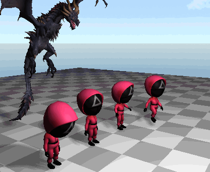

# ZXEngine


这是我自己开发的游戏引擎项目，创建这个项目的主要目的是为了我自己学习和实践游戏引擎技术，不过也希望这个项目能对你有所帮助。

This is a game engine project developed by myself. The main purpose of creating this project is to learn and practice game engine technology for myself, but it would be better if this project can help you.

引擎基本外观如下图，具体内容几句话写不完，请看图示后面的目录。

The appearance of the engine is as shown below. For detailed information, please see the table of contents behind the picture.


## 目录(Contents)

- [引擎简介 (Engine Introduction)](#引擎简介-engine-introduction)
  
- [引擎编辑器和更多演示 (Engine Editor And More Demonstration)](#引擎编辑器和更多演示-engine-editor-and-more-demonstration)
  
- [PhysZ物理引擎简介 (PhysZ Physics Engine Introduction)](#physz物理引擎简介-physz-physics-engine-introduction)
  
- [ZXShader和材质系统 (ZXShader And Material System)](#zxshader和材质系统-zxshader-and-material-system)
  
- [骨骼蒙皮动画系统 (Skeletal Animation System)](#骨骼蒙皮动画系统-skeletal-animation-system)
  
- [GamePlay层的Lua系统 (Lua System of GamePlay Layer)](#gameplay层的lua系统-lua-system-of-gameplay-layer)
  
- [音频系统 (Audio System)](#音频系统-audio-system)
  
- [多线程 (Multithreading)](#多线程-multithreading)
  
- [引擎文件格式介绍 (Engine File Format Introduction)](#引擎文件格式介绍-engine-file-format-introduction)
  
- [构建 (Build)](#构建-build)
  
- [注意事项 (Precautions)](#注意事项-precautions)

## 引擎简介 (Engine Introduction)

本引擎目前同时支持Vulkan，DirectX 12和OpenGL，使用自创的zxshader语言来编写shader，支持前面三种图形API，可一次编写3种环境运行。本引擎同时也支持基于Vulkan和DirectX12的光线追踪渲染管线。

This engine currently supports Vulkan, DirectX 12 and OpenGL. The engine uses the self-created zxshader language to write shaders. It also supports Vulkan, DirectX 12 and OpenGL. You only need to write it once and it can work in all three graphics APIs. This engine also supports ray tracing rendering pipeline based on Vulkan and DirectX12.

本引擎内置了我写的物理引擎PhysZ(看了一些书和别人的项目之后的学习成果，详见后文)，支持基本的刚体力学模拟和布料模拟。同时我也开发了简单的骨骼蒙皮动画系统，粒子系统等。文档后面会有这些系统的图片展示。

This engine has a built-in physics engine written by myself, which I called it PhysZ (It is the learning result after reading some books and other people’s projects), supports rigid body mechanics simulation and cloth simulation. And I also developed a simple skeletal animation system, particle system, etc. Images of these systems are shown later in this document.

引擎本身用C++开发，GamePlay层使用Lua语言，引擎层封装部分C++接口给GamePlay层的Lua调用。使用方式类似Unity的XLua，通过一个GameLogic组件把Lua代码绑定到GameObject上，接收所挂载对象上来自引擎的Start和Update调用，并通过self访问GameObject对象(具体示例看后面)。

The engine is developed with C++, the GamePlay layer uses Lua language, and the engine encapsulates part of the C++ interface to the Lua call of the GamePlay layer. The usage is similar to Unity's XLua, you can bind the Lua code to the GameObject through a GameLogic component, receive Start and Update calls from the engine on the mounted object, and access the GameObject object through self (see later for specific examples).

项目目前已经完成了引擎所需的基本的场景，预制体，材质系统，shader文件系统等等的开发。引擎场景中的对象都是Unity式的 GameObject - Component 结构，也有一个类Unity的引擎编辑器页面。不过编辑功能还不完善，只有一部分 Component 能够被编辑，其它的主要是展示当前的运行时状态。

The project has now completed the development of the basic scenes, prefabs, materials system, shader file systems and so on that the engine need. The objects in the scene of this engine are all Unity-style GameObject - Component structures, and there is also a Unity-like engine editor. However, the editing function is not complete yet, only some Components can be edited, and the others just display the current runtime status.

## 引擎编辑器和更多演示 (Engine Editor And More Demonstration)

下面是一些图片展示，引擎页面如图，和Unity编辑器类似。上面是主菜单栏，中间是游戏画面窗口，左边是展示场景中GameObject的Hierarchy面板，下面左边是展示当前打开项目的Assets文件目录的Project面板，中间是展示日志的Console面板，右边是展示当前选中对象详细信息的Inspector面板。

The following are some picture displays, the engine is shown in the figure, which is similar to the Unity editor. The top is the main menu bar, the middle is the game screen window, the left is the Hierarchy panel showing the GameObject in the scene, the lower left is the Project panel showing the Assets file directory of the currently opened project, the middle is the Console panel showing the log, and the right is showing the currently selected Inspector panel for object details.


当前选中了场景中的Sun对象，Inspector面板就展示这个GameObject所挂载的Component信息。

The Sun object in the scene is currently selected, and the Inspector panel displays the Component information on the GameObject.

点击主菜单栏的运行按钮，游戏开始运行，此时能看到场景中物体动了起来，粒子系统也开始工作。

Click the Play button on the main menu bar, and the game starts to run. At this time, you can see the objects in the scene move, and the particle system starts to work. 

接下来展示的是一个基于PBR+IBL场景渲染，同时展示了点击材质文件后Inspector面板展示的材质信息和材质预览。

Next picture is a scene rendering based on PBR+IBL, and also shows the material information and material preview displayed on the Inspector panel after clicking the material file.


然后通过双击场景文件，切换到一个使用光线追踪渲染管线渲染的场景。同时展示了点击模型文件后Inspector面板展示的模型信息和模型预览，如果模型带有动画还会显示骨骼和动画信息。

Then switch to a scene rendered with the ray tracing pipeline by double-clicking on the scene file. At the same time, it shows the model information and model preview displayed on the Inspector panel after clicking the model file. If the model has animation, the skeleton and animation information will also be displayed.


接下来展示的是通过算法生成的体积云及其阴影投射效果。同时展示了点击图片文件后，Inspector面板显示的图像信息。

Shown next are code-generated volumetric clouds and their shadow casting effects. And the right side shows the image information displayed on the Inspector panel after clicking the image file.


下面是分别点击zxshader和Lua后Inspector上的代码预览。

The following is the code preview on the Inspector after clicking zxshader and Lua respectively.


## PhysZ物理引擎简介 (PhysZ Physics Engine Introduction)

先展示一下PhysZ引擎对刚体力学和布料的模拟效果(GIF演示，截屏大小和帧率都有压缩):

Here is a GIF of the simulation of rigid mechanics and cloth in PhysZ (the size and framerate of the screenshots are compressed):


使用基本的PhysZ物理引擎只需要关心两个Component，Collider和Rigidbody。其中Collider目前提供了三种类型：BoxCollider，PlaneCollider和SphereCollider。下面是这两个Component在引擎里编辑器里的截图：

Using the PhysZ engine involves only two Components, Collider and Rigidbody. Collider currently provides three types: BoxCollider, PlaneCollider and SphereCollider. The following are screenshots of these two Components in the editor in the engine:


各参数作用顾名思义即可。其中Damping参数是模拟各种形式的阻尼效果的，Linear Damping和Angular Damping分别对应线性运动和角运动，数值为0代表无阻尼。

The function of each parameter is just as the name implies. And the Damping parameter is used to simulate various forms of damping effects. Linear Damping and Angular Damping correspond to linear motion and angular motion respectively. A value of 0 represents no damping.

弹簧组件如图，类似Unity的SpringJoint，参数分别是连接对象，自己和连接对象的锚点(各自的模型空间)，弹簧的松弛长度和弹簧系数。

The spring component is shown in the figure, similar to Unity's SpringJoint. The parameters are the connection object, the anchor points of itself and the connection object (their respective model spaces), the rest length and spring coefficient of the spring.


布料模拟需要添加一个Cloth组件，参数分别是布料质量，摩擦系数，弯曲刚度，拉伸刚度和是否使用重力。注意布料需要配合动态Mesh，本引擎暂时只支持DynamicPlane。

Cloth simulation needs to add a Cloth component, the parameters are cloth mass, friction coefficient, bend stiffness, stretch stiffness and whether to use gravity. Note that cloth needs to be matched with dynamic mesh. This engine currently only supports DynamicPlane.


PhysZ引擎主要是我在学习了Ian Millington的《Game Physics Engine Development》和Gabor Szauer的《Game Physics Cookbook》之后，加上一些自己的思考和实践的成果。引擎里的注释也比较多，欢迎对物理引擎感兴趣的人一起讨论学习。

The PhysZ engine is the result of me studying Ian Millington's "Game Physics Engine Development" and Gabor Szauer's "Game Physics Cookbook", plus some of my own thinking and practice. If you are also interested in physics engines, I hope this engine can be helpful to you.

## ZXShader和材质系统 (ZXShader And Material System)

ZXShader是专门给ZXEngine用的一套Shader系统，因为ZXEngine同时支持Vulkan/DirectX12/OpenGL，所以也需要一个统一的Shader语言才能支撑后面的材质系统。ZXShader目前暂时只支持光栅渲染管线，光追渲染管线的Shader是在VK和DX下独立写的。ZXShader语言本身并不复杂，对GLSL，HLSL或者Unity ShaderLab比较熟悉的人应该都能很快看懂，代码示例在ExampleProject\Assets\Shaders中。

ZXShader is a shader system specially used for ZXEngine. Because ZXEngine supports Vulkan/DirectX12/OpenGL, a unified shader language is needed to support the material system. ZXShader currently only supports the rasterization rendering pipeline. The Shader of the raytracing rendering pipeline is written independently under VK and DX. The ZXShader language itself is not complicated. People who are familiar with GLSL, HLSL or Unity ShaderLab should be able to understand it quickly. The code examples are in ExampleProject\Assets\Shaders.

材质系统和Unity的比较类似，就是挂一个Shader，然后可以在编辑器面板上看到这个Shader暴露给引擎的参数。并且可以通过引擎编辑器调整参数数值，然后实时看到渲染结果的动态反馈。直接调整正在运行的场景中的材质：

The material system is similar to Unity's. Select a Shader, and then you can see the parameters exposed by this shader to the engine on the editor panel. And you can adjust parameter values through the engine editor, and then see the feedback of the rendering results in real time. For example, adjust the materials in the running scene:


选中Asset中的材质后，直接调整材质参数，在材质球上预览变化：

This is after selecting the material in the Asset, adjusting the material parameters, and previewing the changes on the material ball:


## 骨骼蒙皮动画系统 (Skeletal Animation System)

切换到AnimDemo场景，点击运行按钮后，可以看到骨骼蒙皮动画的展示:

Switch to the AnimDemo scene and click Play button to see the skeletal animation display:



本引擎的动画系统支持动画混合，所以这里除了能看到单个动画播放外，还能看到人物从走路状态进入跑步状态时，两个动画之间流畅的过渡。

The animation system of this engine supports animation blending, so in addition to the individual animation playback, you can also see the smooth transition between the two animations when the character enters the running state from the walking state.

这里动画的播放代码属于业务逻辑模块而不是引擎，所以是写在Lua代码中的，通过GameLogic组件绑定到对应的GameObject上。

The code to play the animation belongs to the GamePlay rather than the engine, so it‘s written in the Lua code and bound to the GameObject through the GameLogic component.

## GamePlay层的Lua系统 (Lua System of GamePlay Layer)

本引擎的GamePlay层使用Lua语言，引擎将需要提供给GamePlay层的C++接口都Wrap到了Lua，开发方式有点类似于Unity中的XLua。不过目前Wrap到Lua的接口还不是特别多，以后逐步完善。

The GamePlay layer of this engine uses Lua language. The engine wraps all the C++ interfaces that need to be provided to the GamePlay layer into Lua. The development way is similar to XLua in Unity. However, there are not many interfaces that have been wrapped to Lua at present, and they will be gradually added in the future.

使用方式是直接创建一个Lua代码，然后用GameLogic组件把Lua代码挂载到一个GameObject对象上，然后这个Lua代码就可以接收来自引擎的Awake，Start，Update和FixedUpdate等接口的调用了。也可以通过self来访问自己所挂载的GameObject对象，获取Component，调用引擎接口等等。

The way to use lua in ZXEngine is to create a Lua code, and then use the GameLogic component to load the Lua code to a GameObject. Then the Lua code can receive calls from the engine's Awake, Start, Update and FixedUpdate. You can also use self to access the GameObject you bound, obtain components, call the engine interface, etc.

以控制GameObject旋转移动举例，写一个ObjectMove.lua然后挂到一个GameObject上：

Take controlling the rotation and movement of GameObject as an example. Write an ObjectMove.lua and bind it to a GameObject:


然后Lua代码大致如下：

Then the Lua code is as follows:

```lua
local ObjectMove = NewGameLogic()

ObjectMove.radius = 20
ObjectMove.angle = 0
ObjectMove.rot = 0

function ObjectMove:Start()
    self.trans = self.gameObject:GetComponent("Transform")
end

function ObjectMove:Update()
    self.angle = self.angle + 2 * Time.GetDeltaTime()
    local x = math.sin(self.angle) * self.radius
    local z = math.cos(self.angle) * self.radius
    self.trans:SetPosition(x, 0, z)

    self.rot = self.rot + 50 * Time.GetDeltaTime()
    if self.rot > 360 then
        self.rot = self.rot - 360
    end
    self.trans:SetEulerAngles(0, 0, self.rot)
end

return ObjectMove
```

如果是要调用物理引擎相关的接口，和在Unity里一样，需要把代码写到FixedUpdate里面，否则物理效果会有异常。代码示例：

If you want to call the interface related to the physics engine, just like in Unity, you need to write the code in FixedUpdate, otherwise the physical effect will be wrong. Code example:

```lua
local PhysControl = NewGameLogic()

PhysControl.force = { x = 0, y = 100, z = 0 }
PhysControl.velocity = { x = 10, y = 0, z = 0 }

function PhysControl:Start()
    -- Find some gameobject in the scene and control it.
    self.rigidBody = GameObject.Find("SomeObj/SubObj"):GetComponent("RigidBody")
end

function PhysControl:FixedUpdate()
    self.rigidBody:AddForce(self.force)
    self.rigidBody:SetVelocity(self.velocity)
end

return PhysControl
```

如果要接收输入事件，比如写一个Lua脚本挂到相机上控制镜头移动，那么可以注册来自引擎的输入事件。比如注册按住WSAD的回调函数：

If you want to receive input events, such as writing a Lua script to control camera movement, you can register input events from the engine. For example, register the callback function for pressing WSAD:

```lua
EngineEvent:AddEventHandler(EngineEventType.KEY_W_PRESS, MoveForwardCallBack)
EngineEvent:AddEventHandler(EngineEventType.KEY_S_PRESS, MoveBackCallBack)
EngineEvent:AddEventHandler(EngineEventType.KEY_A_PRESS, MoveLeftCallBack)
EngineEvent:AddEventHandler(EngineEventType.KEY_D_PRESS, MoveRightCallBack)
```

ZXEngine的Lua系统接口就不一一列举了，可以到示例工程里细看。

I won’t list ZXEngine’s Lua system interfaces one by one. You can go to the example project to take a look.

## 音频系统 (Audio System)

本引擎的音频系统类似Unity，主要依靠AudioListener和AudioSource这两个组件。

The audio system of this engine is similar to Unity, mainly relying on the two components AudioListener and AudioSource.

AudioSource如下，各参数都比较好理解。

AudioSource is as shown below. These parameters are easy to understand.


其中最后两个参数只在勾选3D音效后生效。MinDistance表示小于这个距离之后音量不会再增大，MaxDistance表示大于这个距离后音量不会再减小。

The last two parameters only take effect in 3D sound effects. When the distance is less than MinDistance, the volume will no longer increase, and when the distance is greater than MaxDistance, the volume will no longer decrease.

AudioListener同样也是用于3D音效的，如果你不需要3D音效的话场景里可以没有这个组件。这个组件挂载到哪个GameObject上就会用哪个GameObject计算3D音效。和Unity一样这个组件不需要任何参数，一般会挂载到主相机所在的GameObject上，如图：


本引擎的绝大部分系统和模块都是我自己编写的，但是音频处理是一个和图形渲染，物理引擎一样很专业的领域，涉及音频编码和时域频域变换等相关专业知识。而我对音频相关的专业知识了解还不够，所以很惭愧，目前本引擎音频系统中的核心部分，即音频解码和播放功能使用了irrKlang这个第三方库。

Most of the systems and modules of this engine are written by myself, but audio processing is a very professional field like graphics rendering and physics engine, involving audio coding, time domain and frequency domain transformation and other related professional knowledge. I don’t know enough about audio-related professional knowledge, so the core part of the audio system of this engine, that is, the audio decoding and playback functions, uses the third-party library irrKlang.

## 多线程 (Multithreading)

目前引擎中实现了多线程的部分有两个，异步加载资源和着色器预编译。其实我还想搞多线程渲染，也在实际尝试搞，但确实有点困难，需要大改引擎框架，所以还没搞好，先鸽着。

Currently, there are two parts of the engine that implement multi-threading, asynchronous loading and shader pre-compilation. In fact, I also want to do multi-threaded rendering, and I‘m actually trying to do it, but it's indeed difficult and requires a lot of modifications to the engine framework, so I haven't done it yet.

资源异步加载的接口如下，直接在主线程(也是逻辑线程)中调用即可：

The interface for asynchronous loading is as follows, which can be called in the main thread (also the logical thread):

```c++
C++ Interface:
static void ZXEngine::GameObject::AsyncCreate(const string& path);
static void ZXEngine::Resources::AsyncLoadPrefab(const string& path, std::function<void(PrefabStruct*)> callback, bool isBuiltIn = false);
static void ZXEngine::Resources::AsyncLoadMaterial(const string& path, std::function<void(MaterialStruct*)> callback, bool isBuiltIn = false, bool isEditor = false);
static void ZXEngine::Resources::AsyncLoadModelData(const string& path, std::function<void(ModelData*)> callback, bool isBuiltIn = false, bool isEditor = false);
```

```lua
Lua Interface:
GameObject.AsyncCreate(path)
```

然后是着色器预编译，在引擎编辑器顶部的菜单栏点击Asset/Compile All Shader for Vulkan或者Compile All Shader for DirectX12，就会开启一个线程去编译Shader。

As for shader pre-compilation, click "Asset/Compile All Shader for Vulkan" or "Compile All Shader for DirectX12" in the menu bar at the top of the engine editor, and a thread will be created to compile the shaders.

## 引擎文件格式介绍 (Engine File Format Introduction)

### *.zxscene

场景文件，包含GameObjects，天空盒等。如果是光线追踪场景，还包含了光追管线的Shader。

Scene files, containing GameObjects, skyboxes, etc. If it is a ray tracing scene, it also includes the Shader of the light tracing pipeline.

### *.zxshader

这是本引擎自己的shader语言文件，不过目前zxshader仅支持DirectX 12，Vulkan和OpenGL的光栅化渲染管线。示例代码可以在ExampleProject\Assets\Shaders中找到。

This is ZXEngine's own shader language file, but currently zxshader only supports the rasterization rendering pipeline of DirectX 12, Vulkan and OpenGL. Example code can be found in ExampleProject\Assets\Shaders.

### *.vkr  *.dxr

这两个后缀分别对应Vulkan和DirectX12的光线追踪Shader代码文件。目前暂未像光栅化管线Shader那样搞一个引擎专用的Shader语言。

These two extension correspond to the ray tracing Shader code files of Vulkan and DirectX12 respectively. For now, there is no engine-specific ray tracing shader language like ZXShader in the rasterization pipeline.

### *.zxmat  *.zxrtmat

分别是光栅化渲染管线和光线追踪渲染管线的材质文件。

They are the material files of the rasterization rendering pipeline and the ray tracing rendering pipeline respectively.

### *.zxprefab

预制体文件，和Unity的prefab差不多。

The prefab file is similar to Unity's prefab.

### *.zxprjcfg

由ZXEngine创建的游戏项目工程的配置文件，可以在ExampleProject中找到参考示例。

This is the configuration file for the game project created by ZXEngine, you can find the example in ExampleProject.

### Others

模型，纹理贴图，字体等就是常见的通用文件格式。

Models, textures, fonts, etc. are common file formats.

## 构建 (Build)

本项目提供了三种构建方式，放在了BuildSolution下面，分别是Visual Studio 2022，xmake和CMake。喜欢用VS的直接用VS 2022打开BuildSolution\VisualStudio\ZXEngine.sln构建即可。如果不想用VS，可以使用xmake，使用方式如下：

This project provides three building methods, which are placed under BuildSolution, including Visual Studio 2022, xmake and CMake. If you like to use VS, just use VS 2022 to open BuildSolution\VisualStudio\ZXEngine.sln to build. If you don’t want to use VS, you can use xmake as follows:

```shell
cd BuildSolution\xmake
xmake
xmake run zxengine
```

最后是CMake，不过不是很推荐使用。因为CMake写起来比较麻烦，我是在工具生成的基础上再手动调整一下写出来的，所以不保证各种环境和使用方式下都没问题。更推荐xmake，要简单好用一些。

Finally, there is CMake, but it is not recommended. Because I'm not very familiar with writing CMake, I use a tool to generate the CMake file, and then manually modified it, so I cannot guarantee that there will be no problem in various environments and usage methods. I recommend xmake, which is simpler and easier to use.

```shell
cd BuildSolution\CMake
cmake CMakeLists.txt
```

由于我公司的开发环境以及我自己的电脑都是Windows，所以目前本项目仅支持Windows系统。跨平台的想法我是有的，但是我的精力有限。这只是我用空闲时间开发的项目，还有不少我想做的东西没做，所以短期内还不会做跨平台支持，感谢大家的理解。

Since the development environment of the company I work for and my own computer are both Windows, this project currently only supports Windows systems. I have the idea of cross-platform, but my energy is limited. This is just a project I developed in my free time. There are a lot of things I want to do but haven't done yet, so I will not provide cross-platform support in the short term. I appreciate your understanding.

## 注意事项 (Precautions)

目前zxshader编写好后，在DirectX 12和OpenGL下直接运行即可。但是在Vulkan下需要先点击引擎菜单栏里的“Assets/Compile All Shader for Vulkan”按钮，将zxshader预编译后才可以运行。也就是说，在你第一次以Vulkan模式运行工程之前，至少需要先以DirectX 12或者OpenGL模式启动一次项目，完成一次预编译Vulkan着色器，然后才能正常的以Vulkan模式启动。这块做得不是很好，按理说不应该有这种奇怪的限制，日后改进。

After zxshader is written, it can be run directly under DirectX 12 and OpenGL. But under Vulkan, you need to click the "Assets/Compile All Shader for Vulkan" button in the engine menu bar to precompile zxshader before it can run. In other words, before you run the project in Vulkan for the first time, you need to start the project in DirectX 12 or OpenGL at least once, complete a precompilation of the Vulkan shader, and then start engine in Vulkan. It's not very well done here, there shouldn't be such a strange restriction, and it will be improved in the future.

切换图形API的方式是在pubh.h文件中修改宏定义。有3个宏定义ZX_API_VULKAN，ZX_API_D3D12和ZX_API_OPENGL，分别对应引擎支持的3个图形API。开启其中一个宏定义，并注释掉其它2个宏定义，重新编译引擎，就完成了对图形API的切换。

The way to switch the graphics API is to modify the macro definition in the pubh.h file. There are 3 macro definitions ZX_API_VULKAN, ZX_API_D3D12 and ZX_API_OPENGL, corresponding to the 3 graphics APIs supported by the engine. Open one of the macro definitions, comment out the other two macro definitions, and recompile the engine to complete the switching of the graphics API.

作为一个个人项目，本项目还没有在各种不同设备环境下进行过严格的测试，所以不排除在某些设备下会出现异常。当然也有可能在我不停更新本项目的过程中写出一些我没发现的BUG。所以如果你在编译或者运行项目的过程中遇到了异常，欢迎向我提出。如果你有什么疑问，或者有什么想和我讨论的，可以通过我Github主页的邮箱联系我，或者通过我的知乎主页私信我。

As a personal project, this project has not been rigorously tested in various environments, so it cannot be ruled out that exceptions may occur under certain devices. Of course, it's also possible that I may write some bugs that I have not discovered as I continue to update this project. So if you encounter an exception when compiling or running the project, you can report it to me. If you have any questions or want to discuss anything with me, you can contact me through the email on my Github homepage, or send me a message through my Zhihu homepage.

### 一些废话 (Some mumbles)

其实工程在2020年5月就创建了，但是最初其实只是想把2020年初学习OpenGL写的代码保存到GitHub上而已。当时写的代码也只是C语言风格的面向过程式编程，一个1000多行的渲染demo。随后花了1年多时间把《Real-Time Rendering 4th》看了，这期间光看书没再实际写东西了（因为这书实在是太偏理论了，没什么可以立刻实践的东西）。

In fact, the project was created in May 2020, but at first I just wanted to save the code I wrote when I learned OpenGL in early 2020 to GitHub. The code I wrote at that time was only procedure oriented programming in C language style, a rendering demo with less than 2000 lines. Then I spent more than a year reading "Real-Time Rendering 4th". During this period, I just read the book and didn't actually write anything (because this book is too theoretical, and there is nothing that can be practiced immediately).

其实当时那个1000多行的demo写完我还想继续加点东西上去，但是感觉加不动了，面向过程的代码实在是难扩展。就一直想把这个demo改成一个正式一点的，有渲染框架的工程，但是不知道从何改起，就一直没动，先看书去了。书看完了还是不知道怎么开始，就沉寂了几个月。最后等到了2022年我才开始正式搭建这个工程，准备开发成一个自己的简单游戏引擎。其实我当时应该建一个新的GitHub仓库的，而不是用这个学习OpenGL的仓库。但是当时对C++工程还很陌生，感觉各种环境配置和库链接太麻烦了，就偷懒直接用这个已经搭好的OpenGL开发环境开始搭建引擎了。所以工程里还有之前的demo代码记录。

In fact, after the demo was written, I wanted to continue to add something, but I felt that it couldn't be done, because the procedure oriented code was really difficult to expand. I have always wanted to make this demo a more formal project with a rendering framework, but I don't know where to start, so I haven't moved, and I read the book first. After reading the book, I still didn't know how to start, so I fell silent for several months. Finally, in 2022, I started to build this project, preparing to develop a simple game engine of my own. In fact, I should have built a new GitHub repository instead of using this repository for learning OpenGL. But at that time, I was still very unfamiliar with C++ projects. I felt that various environment configurations and library links were too troublesome, so I was slack off and started building the engine directly with this already established OpenGL development environment. So there are also previous demo code commits in the project.

这个工程我准备用自己工作之余的时间长期更新下去，慢慢完善，添加更高级的特性。也把这个工程当作自己一个学习技术的平台，有什么感兴趣的技术可以在自己这个工程里实验一下。也希望同样对引擎技术感兴趣的人可以一起分享。因为我之前沉寂了几个月迟迟没有开始，就是因为不知道从何开始。我想找一个简单的参考项目，但是找不到。要么就是UE5这种过于庞大和成熟的引擎，要么就是一些很老的比如Ogre这样的引擎，反正我没有找到一个合适的项目让我学习。我这个项目有很多实现是自己瞎想的，还比较简单，换句话说也比较简陋。所以有大佬看到感觉写的不好的地方，欢迎提出建议。可以发邮件给我，ashenvalezx@gmail.com，或者点我头像进主页来知乎私信我。

I plan to use my spare time to keep updating this project, gradually improve it, and add more advanced features. I also regard this project as a platform for my own learning. I can experiment with any interesting technologies in my own project. I also hope that people who are also interested in game engine technology can share it together. I waited for months and didn't start the project because I didn't know where to start. I'm trying to find a relatively simple project to learn from, but can't find it. Either it is an overly large and mature engine like UE5, or some very old engines such as Ogre. Anyway, I didn't find a suitable project for me to learn. Many of the implementations of my project are thought by myself, and they are relatively simple, in other words, they are relatively crude. So if someone sees some implementations that are not good, suggestions are welcome. You can email me, ashenvalezx@gmail.com

